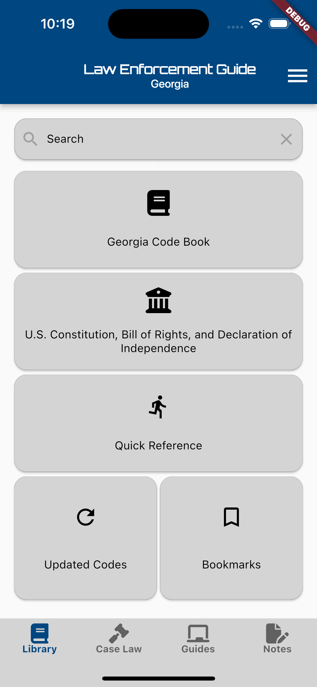
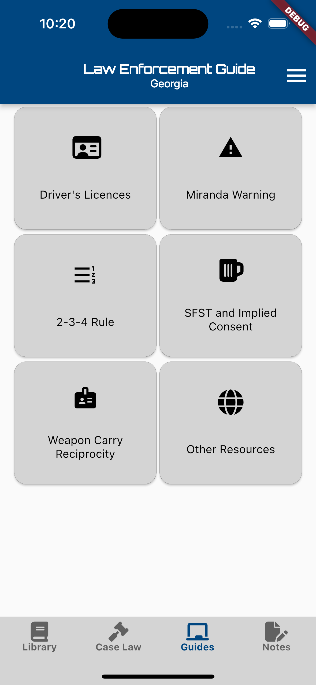
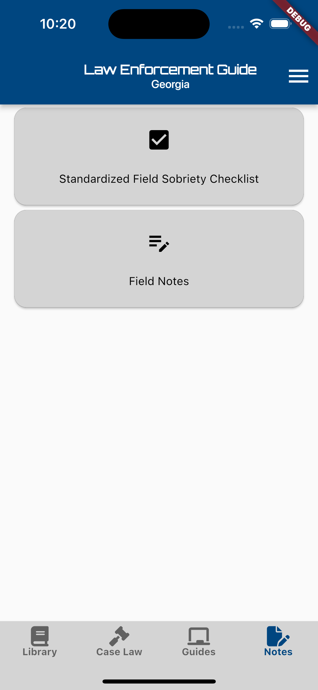

# Law Enforcement Guide

An app for Law Enforcement to help them with their day to day tasks. With over 7,000 downloads, it provides helpful guides, note taking, and acess to statutes related Law Enforcement's job.

It is available on the [Apple App Store](https://apps.apple.com/us/app/law-enforcement-guide/id1376579488?platform=iphone) and on the [Google Play Store](https://play.google.com/store/apps/datasafety?id=com.fandysoft.lawenforcementguide_georgia)

## Responsibilities and Duties

- UI & UX Design (Figma & Lucid Chart)
- CI & CD automation implementation (GitHub Actions)
- Development planning (Jira)
- Backend Development (Firebase, Dart)
- Frontend Development (Flutter, Dart, React, JavaScript, Typescript)
- Testing procedures

## Frameworks Used

- Flutter
- React
- Firebase
- GitHub Actions

## Languages Used

- Dart
- JavaScript
- TypeScript
- HTML
- CSS

## Databases Used

- Firebase
- Firestore
- Realtime Database
- Cloud Storage
- No SQL Lite
- SQL Lite

## Screenshots
    
       
